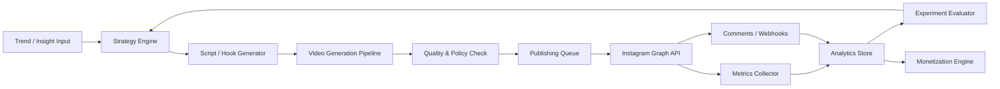

# Instagram AI自動運用 設計メモ

## 1. 結論

結論から言うと、**InstagramへのAI動画投稿を自動化し、分析結果を使ってPDCAを継続的に回す仕組みは実装可能**です。

ただし、完全に自由な自動化ではなく、以下の条件が前提です。

- **公式APIだけで組むこと**
- **InstagramのProfessionalアカウント（Business/Creator）を使うこと**
- **Stories自動投稿はBusinessアカウント前提で設計すること**
- **分析データの取得範囲や保存期間に制約があることを受け入れること**
- **コンテンツ安全性と収益導線には人間の監督ポイントを残すこと**

推定として、24時間稼働の「完全無人AI運用」は技術的には作れますが、実務上は**人間レビュー付きの半自律運用**から始める方が成功確率が高いです。

## 2. 公式制約の要点

### 投稿自動化

- Instagram APIは、Professionalアカウント向けに**投稿・コメント管理・分析取得**を提供しています。
- Facebook LoginベースのInstagram APIでは、**Stories以外のContent PublishingはProfessional全体**、**StoriesはBusinessのみ**と案内されています。
- ReelsはAPI経由で公開可能です。Meta公式のPostmanドキュメントには、Reels公開用のコンテナ作成と`/media_publish`の流れが記載されています。

### 分析

- Insights APIで、**アカウント単位**と**メディア単位**の指標取得が可能です。
- ただし、公式案内では以下の制約があります。
  - 一部メトリクスは**フォロワー100未満だと使えない場合がある**
  - ユーザーメトリクスは**最大90日保存**
  - 取得できるのは**Professionalアカウントが所有するメディア**

### コメント・反応収集

- コメント取得はAPIクエリでもできますが、Meta公式コレクションでは**レート制限回避のためWebhooks推奨**です。

### 禁止寄りの実装

- Metaの利用規約では、**事前許可なしの自動データ収集や自動アクセス**を禁じています。
- そのため、**非公式スクレイピング、ブラウザ自動操作、疑似ログインbot**を前提にした設計は避けるべきです。

## 3. 何ができて、何ができないか

### できること

- AIで台本を作る
- AIで画像・動画・音声を生成する
- FFmpegなどでReels/Stories向けに書き出す
- 予約キューに流して自動投稿する
- 投稿後のメトリクスを定期回収する
- コメント/反応を集約して評価スコア化する
- どのテーマ、構成、尺、CTAが強いかを学習し、次回企画へ反映する

### できない、または制約が強いこと

- Personalアカウントを前提にした公式自動投稿
- 非公式botで人間操作を偽装する安全運用
- Instagram外のすべての競合データを自由に自動収集すること
- 収益化を完全自動で最大化すること
  - 理由: ブランド安全性、広告表記、規約遵守、商材品質の審査が必要

## 4. 推奨アーキテクチャ

## 5. システム構成案

### A. Strategy Engine

役割:

- 投稿ジャンル決定
- ペルソナ別の企画出し
- フック、タイトル、CTA生成
- 仮説管理

入力:

- 過去投稿の成績
- 投稿時間帯
- フォロワー増減
- コメント内容
- 手動で与えるブランド方針

出力:

- 投稿案
- A/Bテスト案
- 期待KPI

### B. Video Generation Pipeline

役割:

- 台本生成
- ナレーション生成
- 静止画/動画生成
- 字幕焼き込み
- Reels/Stories/Feedの3形式へ再構成

推奨サブ構成:

- LLM: 企画、台本、CTA
- TTS: ナレーション
- 画像/動画生成モデル: 素材生成
- FFmpeg: リサイズ、字幕、音量、書き出し

### C. Quality & Policy Check

役割:

- NGワード検査
- 誇大表現検査
- 商材表記漏れ検査
- アフィリエイト/案件表記の要否判定
- サムネと字幕の読みやすさ検査

ここは完全自動にせず、最初は**人間承認ステップあり**が安全です。

### D. Publishing Queue

役割:

- 投稿タイミング管理
- アカウント別キュー
- 失敗時の再試行
- 投稿本数の上限制御

重要:

- Metaの公開資料には24時間単位の公開上限の記載があるため、**内部ルールでさらに低い安全上限**を設ける
- 初期は**1アカウントあたり1日3〜6投稿**程度から始める

### E. Analytics Store / Evaluator

役割:

- メディアごとの指標保存
- 日次・週次で勝ちパターン抽出
- 投稿変数ごとの回帰分析
- 次回企画へのフィードバック

保存したい特徴量:

- ジャンル
- 尺
- 1秒目のフック文
- CTA種類
- 投稿時間
- BGM有無
- 顔出し有無
- 字幕量
- 背景色/テンポ

評価指標例:

- Reach
- Views
- Watch-through率
- Saves
- Shares
- Profile visits
- Follows per 1,000 views
- CTR相当値
- 収益/1,000 views

## 6. 無限PDCAの実装イメージ

### Loop 1: 投稿仮説生成

- 直近7日・30日の勝ちパターンを集計
- 上位テーマから次の企画を自動生成
- 企画ごとにCTAとマネタイズ導線を割り当て

### Loop 2: 生成と投稿

- 台本生成
- 動画生成
- 品質チェック
- 予約投稿

### Loop 3: 計測

- 投稿後1時間、24時間、72時間、7日で指標取得
- コメントの感情と購買意図を分類

### Loop 4: 学習

- 何が伸びたかを特徴量ベースで評価
- 次回の生成プロンプトと配信時間へ反映

### Loop 5: Monetization Optimization

- CTAごとの成約率を比較
- LP、LINE、DM誘導、アフィリエイト案件別にCVR比較
- 高CVR導線を優先採用

## 7. マネタイズ設計

収益化はInstagram内だけに閉じない方が強いです。推奨順位は以下です。

### 1. 外部導線型

- 自社商品
- デジタル商品
- 相談予約
- LINE登録
- メルマガ登録
- 外部LPへの誘導

最も制御しやすく、収益予測もしやすいです。

### 2. アフィリエイト型

- リールやストーリーから商材導線を作る
- ただし、Instagram Help Centerでは**アフィリエイトリンクを含む投稿はPaid partnershipラベル対象**と案内されています

### 3. ブランド案件型

- 案件投稿
- Partnership Ads
- Creator Marketplace活用

単価が大きいので、フォロワー規模が育つほど強いです。

### 4. Instagram内収益化

- Gifts
- Subscriptions

これは**地域・年齢・フォロワー数・ポリシー適合性などの条件依存**です。実装前提ではなく、使えれば追加する位置づけが安全です。

## 8. 実装フェーズ案

### Phase 0: 事前準備

- BusinessまたはCreatorアカウント準備
- 可能ならBusinessで開始
- Facebook App / Meta App作成
- Professionalアカウント接続
- 必要権限の整理
- 監査ログと投稿履歴DB設計

### Phase 1: MVP

目標:

- 1ジャンル
- 1アカウント
- 1日3本前後
- 人間承認あり

作るもの:

- コンテンツ生成
- 自動予約投稿
- 基本メトリクス回収
- ダッシュボード

成功条件:

- 投稿失敗率5%未満
- KPI取得漏れなし
- 投稿から分析まで自動連携

### Phase 2: 半自律PDCA

目標:

- 投稿成績から次企画を自動提案
- A/Bテスト自動化
- コメント解析導入

作るもの:

- 企画スコアラー
- CTA比較
- 時間帯最適化
- Webhooksベースの反応集約

### Phase 3: 収益化強化

目標:

- 投稿ごとにマネタイズ導線を持たせる
- コンテンツと収益の相関を追えるようにする

作るもの:

- LP別の成果測定
- CTAテンプレート群
- アフィリエイト案件別のCVR計測
- ブランド案件テンプレート

### Phase 4: 多アカウント化

目標:

- 複数ジャンル
- 複数アカウント
- 役割別エージェント分離

作るもの:

- アカウント横断管理
- コンテンツ再利用ルール
- アカウントごとのブランドガードレール

## 9. 推奨技術スタック

初期の現実解:

- Backend: Python + FastAPI
- Worker: Celery or RQ + Redis
- DB: PostgreSQL
- File Storage: S3互換ストレージ
- Analytics: Metabase or Superset
- AI Orchestration: Pythonサービス化
- Media: FFmpeg
- Scheduler: cronではなくジョブキュー中心

理由:

- AI処理、動画処理、分析処理の相性がよい
- 24時間運用で再試行やキュー制御をしやすい
- MVPから拡張まで無理が少ない

## 10. 最初の30日でやるべきこと

1. Businessアカウントで始める
2. Instagram API接続を通す
3. Reels 1本の自動投稿を成功させる
4. 投稿IDとインサイト取得をDB保存する
5. 日次レポートを自動生成する
6. 動画テンプレートを3本作る
7. CTAを3種類に絞って比較する
8. 収益導線を1つに絞る

## 11. 重要リスク

### 規約リスク

- 非公式自動化は避ける
- 投稿頻度を上げすぎない
- アフィリエイトや案件表記を漏らさない

### 品質リスク

- AI動画を量産しても刺さらない可能性が高い
- 量よりもテーマ精度とフック品質が重要

### データリスク

- 一部インサイトは遅延する
- API仕様変更に備えて抽象化層が必要

### 事業リスク

- フォロワー増加と売上増加は別問題
- 収益化導線を最初から設計しないと再生だけ増えて終わる

## 12. 実装方針の提案

最初から「完全無人・全自動・多アカウント」はやらず、以下の順で進めるのがよいです。

1. まずは1アカウントでReels中心の自動投稿MVPを作る
2. 次にInsights取得とコメント収集をつなぐ
3. その後でPDCAの自動化を入れる
4. 最後に収益最適化を入れる

この順番なら、規約・技術・収益の3つを同時に破綻させにくいです。

## 13. 参考ソース

- Meta公式Instagram API Workspace: https://www.postman.com/meta/instagram/documentation/6yqw8pt/instagram-api
- Instagram API with Facebook Login: https://www.postman.com/meta/instagram/folder/3uqmcgi/instagram-api-with-facebook-login
- Instagram API with Instagram Login: https://www.postman.com/meta/instagram/folder/6raa77c/instagram-api-with-instagram-login
- Reels Publishing: https://www.postman.com/meta/instagram/folder/zbnz1q0/reels-publishing
- Publish the container (Reels): https://www.postman.com/meta/instagram/request/b25b70f/publish-the-container-reels
- Insights: https://www.postman.com/meta/instagram/folder/w5jo9vk/insights
- Comment webhook: https://www.postman.com/meta/instagram/request/gg841ub/comment-webhook
- Get Comments: https://www.postman.com/meta/instagram/request/l983l25/get-comments
- Meta Terms: https://www.facebook.com/legal/terms
- Automated Data Collection Terms: https://www.facebook.com/apps/site_scraping_tos_terms.php
- Branded content / affiliate link guidance: https://www.facebook.com/help/instagram/616901995832907/
- Paid partnership label guidance: https://www.facebook.com/help/instagram/1317960375957564/
- Partnership ads eligibility: https://www.facebook.com/help/instagram/1372533836927082/
- Creator monetization updates: https://about.fb.com/news/2023/11/giving-creators-more-ways-to-earn-money-on-facebook-and-instagram/amp/
- Gifts on Instagram: https://about.fb.com/news/2023/02/earn-money-on-instagram-with-gifts/
- Creator Marketplace update: https://about.fb.com/news/2024/02/creator-marketplace-for-brands-and-creators-to-collaborate-on-instagram/
